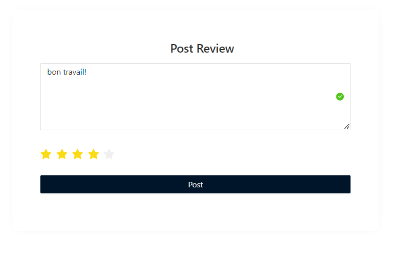

# Système de Réservation de Services

Ce projet est un système de réservation de services construit avec Angular, Spring Boot, MySQL et Ng Zorro UI.

## Fonctionnalités

### Fonctionnalités pour les Entreprises :
- **Créer un Compte :** Les entreprises peuvent créer leur compte pour accéder au système.
- **Connexion :** Fonctionnalité de connexion sécurisée pour les entreprises enregistrées.
- **Publier des Annonces :** Les entreprises peuvent publier des annonces pour leurs services.
- **Mettre à Jour & Supprimer des Annonces :** Possibilité de mettre à jour ou de supprimer des annonces publiées.
- **Voir les Réservations :** Les entreprises peuvent voir les réservations effectuées par les clients.
- **Approuver ou Rejeter une Réservation :** Fonctionnalité pour approuver ou rejeter les demandes de réservation.
  


### Fonctionnalités pour les Clients :
- **Créer un Compte :** Les clients peuvent créer leur compte pour accéder au système.
- **Connexion :** Fonctionnalité de connexion sécurisée pour les clients enregistrés.
- **Rechercher des Services :** Les clients peuvent rechercher les services proposés par les entreprises.
- **Voir les Détails des Annonces et les Avis :** Les clients peuvent voir les détails des annonces et lire les avis.
- **Réserver des Services :** Les clients peuvent réserver les services proposés par les entreprises.
- **Voir les Réservations :** Les clients peuvent consulter leur historique de réservations.
- **Évaluer les Services :** Les clients peuvent fournir des avis et des notes pour les services utilisés.
  





## Technologies Utilisées

- **Frontend :** Angular avec les composants Ng Zorro UI
- **Backend :** Spring Boot
- **Base de Données :** MySQL
- **Style :** Ng Zorro UI

## Instructions d'Installation

Pour exécuter ce projet localement, suivez ces étapes :

1. **Clonez le dépôt :**
   ```bash
   git clone https://github.com/hananebouchouikra189/Service_Booking_System.git
   cd Service_Booking_System
